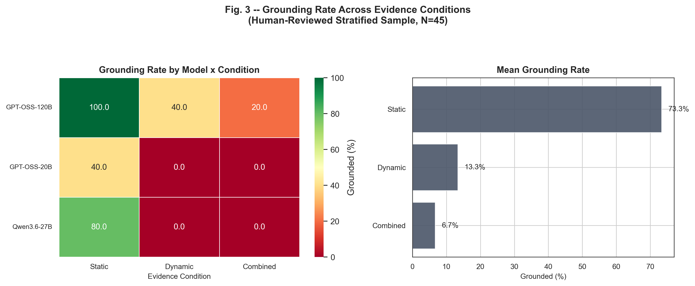
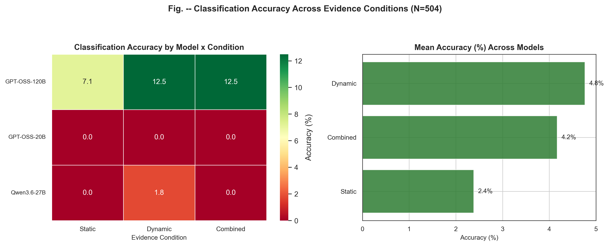

# GroundedTriage

**Evidence-Dependent Hallucination in LLM-Based Malware Triage**

Noor-ul-ain Iqbal · Beaconhouse National University · 2026

[](https://groundedtriage.streamlit.app/)

---

## Summary

Does giving a large language model *more* evidence make it better at malware triage — or just more confident? We evaluate three LLMs (GPT-OSS-20B, GPT-OSS-120B, Qwen3.6-27B) across 56 real-world malware samples spanning 7 families, varying the evidence shown from sparse static file metadata to full dynamic behavioral analysis.

**The finding:** classification accuracy stays statistically flat across this progression (2.4% → 4.8% → 4.2%, χ² not significant, p = 0.49), while model abstention collapses sharply as evidence increases (59.5% → 12.5%, p < 0.0001, large effect). A stratified human review of 45 model justifications shows this growing confidence is largely unearned — the proportion of justifications actually grounded in the evidence shown collapses from **73.3% to 6.7%** (Fisher's exact test, p < 0.001).

Richer evidence doesn't improve reasoning here. It gives the model more surface area to construct a plausible-sounding, unsupported narrative.

**[Try the live demo →](https://groundedtriage.streamlit.app/)**

---

## Key Figures



*Human-verified grounding rate collapses as evidence richness increases (N=45, stratified sample).*



*Accuracy stays flat while abstention drops — models commit to more answers without becoming more correct (N=504).*

More figures, including per-family accuracy and the row-normalized outcome confusion matrix, are in [`figures/`](figures/).

---

## Methodology

- **Data:** 56 real malware samples across 7 families (Vidar, njrat, WannaCry, NanoCore, CoinMiner, ConnectWise, NetSupport), each verified to have a real, non-empty behavioral report — not just a signature label. Samples and family ground truth from [MalwareBazaar](https://bazaar.abuse.ch/) (multi-engine consensus); static + dynamic evidence from [Hybrid Analysis](https://www.hybrid-analysis.com/). Mirai was excluded — its non-Windows architecture is fundamentally incompatible with the Windows sandbox used here.
- **Evidence conditions:** each sample's report is split into **static-only** (file structure, imports, certificates), **dynamic-only** (process behavior, network activity, MITRE ATT&CK techniques), and **combined** evidence bundles. Any field that would leak the answer (AV verdict, family tag) is deliberately excluded.
- **Models:** three open-weight models via the Groq API — `openai/gpt-oss-20b`, `openai/gpt-oss-120b`, `qwen/qwen3.6-27b`.
- **Evaluation:** 56 samples × 3 conditions × 3 models = 504 total responses, each scored against ground truth for family-classification accuracy and abstention.
- **Grounding check:** a stratified sample of 45 responses (5 per model × condition cell) was manually reviewed against the underlying evidence and labeled GROUNDED / PARTIAL / FABRICATED, using a strict rule: any unsupported family-specific attribution — even alongside otherwise-accurate evidence description — is not GROUNDED.
- **Statistics:** chi-square tests of independence with Cramér's V effect size on the full 504-response dataset; Fisher's exact test as a robustness check on the smaller grounding sample.

Full methodology, limitations, and discussion: see [`REPORT.md`](REPORT.md) *(coming soon)*.

---

## Try It Yourself

**Live demo:** [groundedtriage.streamlit.app](https://groundedtriage.streamlit.app/) — paste evidence, pick a model, see a live triage result and judge its grounding yourself.

**Or run the API locally:**
```bash
docker build -t groundedtriage .
docker run -p 8000:8000 --env-file .env groundedtriage
curl -X POST http://localhost:8000/analyze \
  -H "Content-Type: application/json" \
  -d '{"evidence": "your evidence text here"}'
```

---

## Repository Structure